# Dokumentacja projektu Learn Notes With Me

Learn Notes With Me to aplikacja do nauki podstawowych nut na pianinie.

👉 [https://learn-notes-with-me.azurewebsites.net/](https://learn-notes-with-me.azurewebsites.net/)

# Opis implementacji

Aplikacja serwerowa zbudowana jest przy pomocy narzędzia `NestJS` na środowisku `NodeJS`. Aplikacja kliencka zaimplementowana jest dzięki bibliotece `React`. Zarówno po stronie serwera jak i klienta aplikacja napisana jest w języku `TypeScript`.

Aplikacja wdrażana jest na chmurę Microsoft Azure przy pomocy Github Actions. Przed wdrożeniem uruchamiane są testy jednostkowe.

# Struktura katalogów

```bash
├── README.md
├── client/ # aplikację kliencką
│   ├── package.json # zależności części klienckiej
│   ├── public/ # folder ze statycznym plikiem HTML oraz ikoną aplikacji
│   └── src/
│       ├── __tests__ # folder zawierający testy jednostkowe części kliienckiej
│       ├── index.tsx # plik, od którego rozpoczyna się uruchomienie aplikacji klienckiej
│       ├── App.tsx # właściwa część aplikacji
│       ├── components/ # reużywalne komponenty
│       ├── external/ # folder zawierający pliki konfiguracyjne z zewnętrznymi serwisami
│       ├── icons/ # ikony
│       ├── pages/ # ekrany aplikacji
│       ├── style/ # globalne ustawienie styli aplikacji
│       └── utils/ 
├── src/ # folder z plikami źródłowymi części serwerowej
│   ├── lesson/ # moduł odpowiadającego za logikę nauki nut
│   └── main.ts # plik, od którego rozpoczyna się uruchomienie aplikacji klienckiej
├── test/ # folder zawierający testy jednostkowe części serwerowej
└── package.json # zależności części serwerowej
```

# Interfejs graficzny

Na interfejs aplikacji składają się trzy ekrany:

## Strona startowa

Na tej stronie jedynym elementem wartym uwagi jest przycisk znajujący się w prawym górnym rogu interfejsu służący do logowania się w aplikacji.

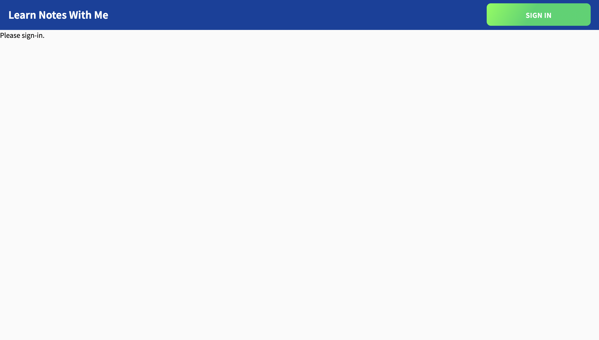

## Strona główna

Głównym elementem strony głównej projektu jest przycisk rozpoczynający lekcję. Użytkownik ma również możliwość wylogowania się z aplikacji. Na stronie znajdują się przyciski pomocnicze wywołujące błędy 404 oraz 500 służące do łatwego wyzwalania alertów mailowych podczas live-demo 😅

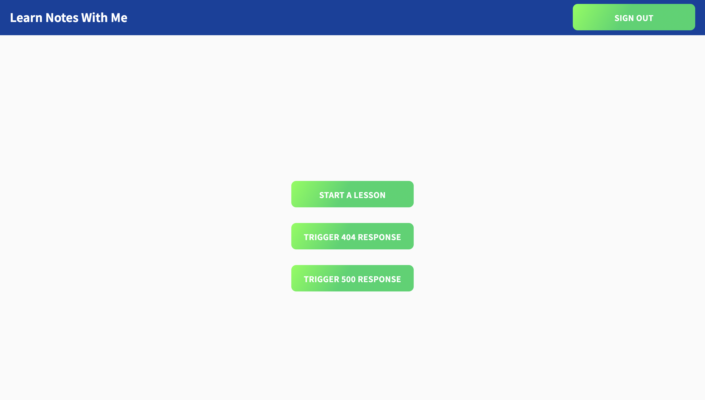

### Ekran nauki

W centralnej części interfejsu pokazywana jest nuta, którą użytkownik powinien zagrać na interaktywnym pianinie. Prawidłowa odpowiedź skutkuje naliczeniem punktów oraz odblokowaniem przycisku pozwalającego przejście do następnego kroku lekcji. Lekcja domyślnie składa się z pięciu kroków. Użytkownik ma również możliwość powrotu z tego ekranu przy pomocy "X" znajdującego się w prawym górnym rogu interfejsu.

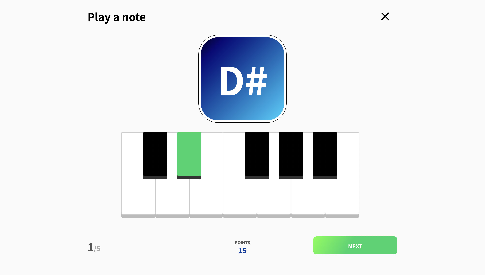

# Wykorzystane komponenty Azure

Wszystkie wykorzystanie komponenty Azure, z wyjątkiem autoryzacji `Azure Active Directory` ze względu na ograniczenia praw dostępu obecnych w organizacji, znajdują się w jednym `Resource group` .

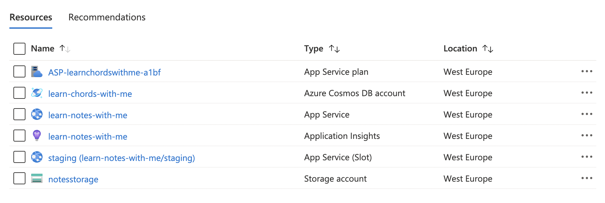

Na wykorzystane komponenty w projekcie składa się:
- App Service
  - Deployment slots
- Application Insights
  - Metryki
  - Alerty
  - Performance
- Azure Cosmos DB
- Storage account
- Active Directory

## App Service

Kluczową częścią projektu jest aplikacja Node wdrożona jako WebApp.

Aplikacja wdrożona jest na dwa środowiska - `production` oraz `staging`. Skonfigurowane jest poprzez użycie tzw. deployment sloty a wdrożenie na odpowiednie środowiska odbywa się dzięki Github Actions. Ponieważ darmowy plan nie udostępnia funkcjonalności slotów deploymentu aplikacja korzysta z płatnego tieru `S1`.

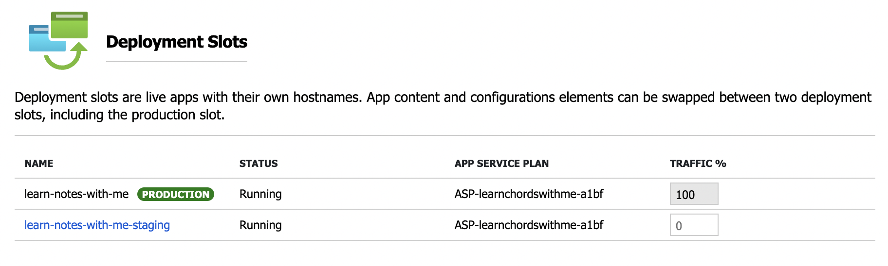


Pliki `yml` Github Actions to odpowiednio [.github/workflows/main_learn-notes-with-me.yml](.github/workflows/main_learn-notes-with-me.yml) oraz
[.github/workflows/staging_learn-notes-with-me(staging).yml](.github/workflows/staging_learn-notes-with-me(staging).yml).

Zmienne środowiskowe wstrzykiwane są do aplikacji serwerowowej i znajdują się w `Application Settings`.

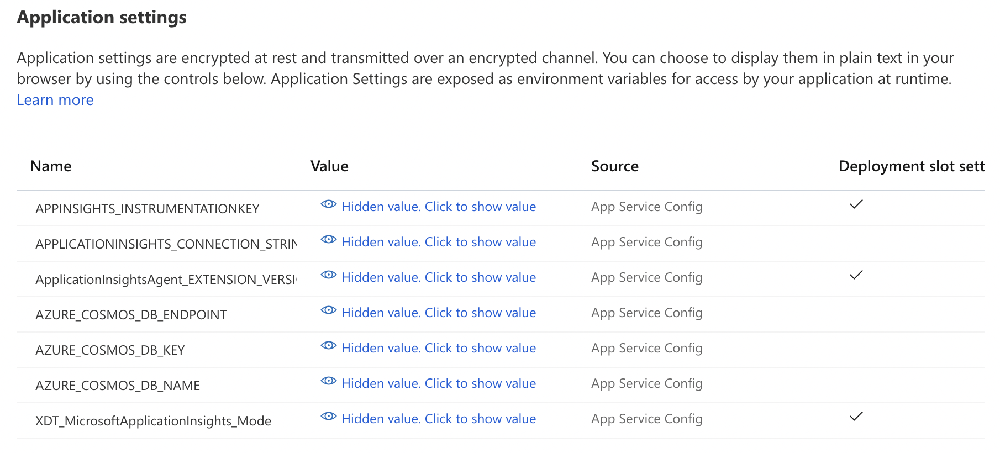

## Application Insights

W aplikacji zaimplementowana jest funkcjonalność metryk, która umożliwa podgląd na żywo wykorzystywania przez użytkowników co do dokładności na jakich stronach się znajdują, w które przyciski klikają etc.

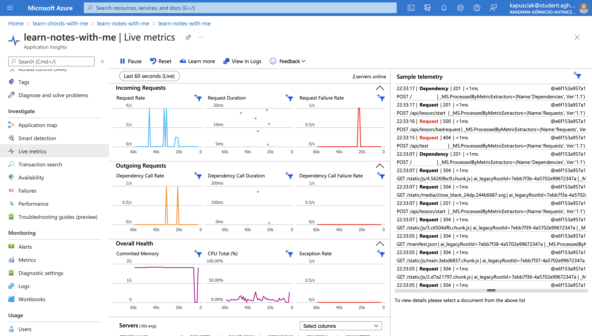

Skonfigurowane jest także wywoływanie alertów mailowych wysyłanych do administratorów apliacji po osiągnięciu pewnej ilości błędów w aplikacji.

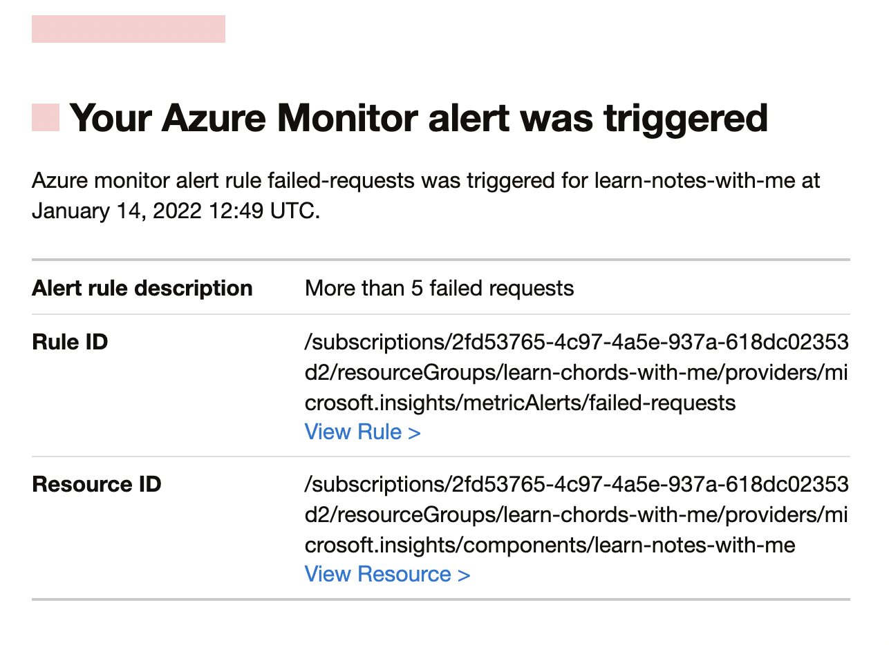

Mamy także możliwość mierzenia wydajności aplikacji - w tym czasu wykonywania zapytania.

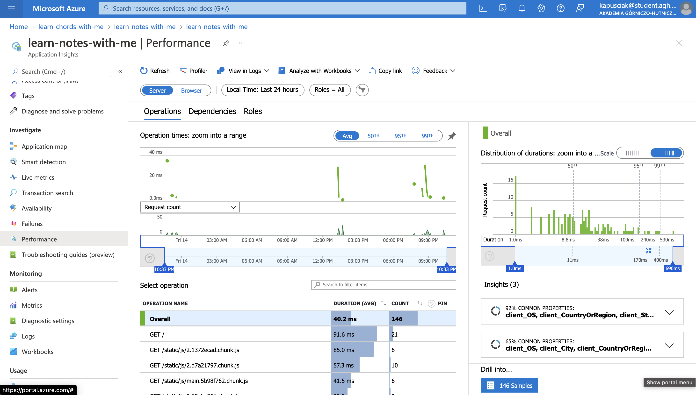

## Azure Cosmos DB

Baza danych Azure Cosmos DB składa się z jednego containera - `lesson` - przechowującego wszystkie lekcje rozpoczęte przez użytkowników aplikacji.

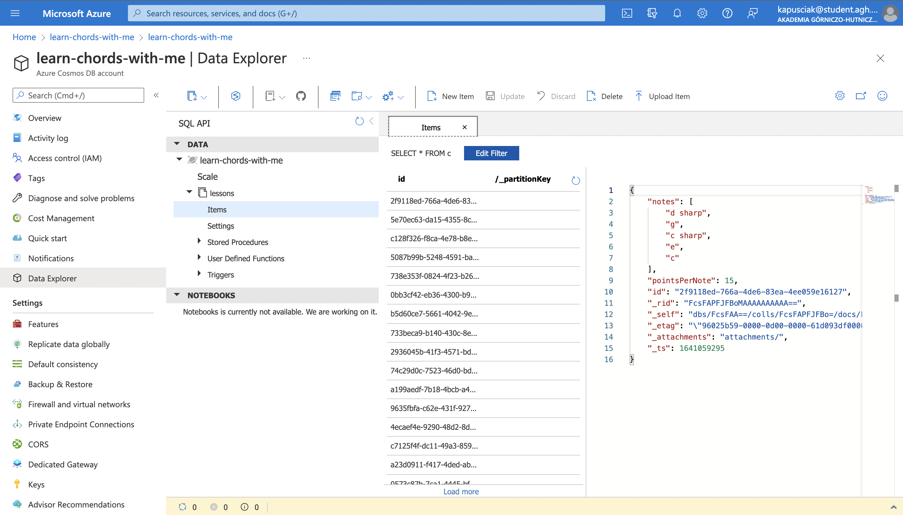

## Storage account

Aplikacja korzysta z Blob storage do przechowywania dźwięków `mp3` wykorzystywanych przez wirtualne pianino w aplikacji klienckiej. Przykładowy zestaw dźwięków możemy znaleźć pod adresem: [https://notesstorage.blob.core.windows.net/sounds/grand_piano_white_only.mp3](https://notesstorage.blob.core.windows.net/sounds/grand_piano_white_only.mp3)

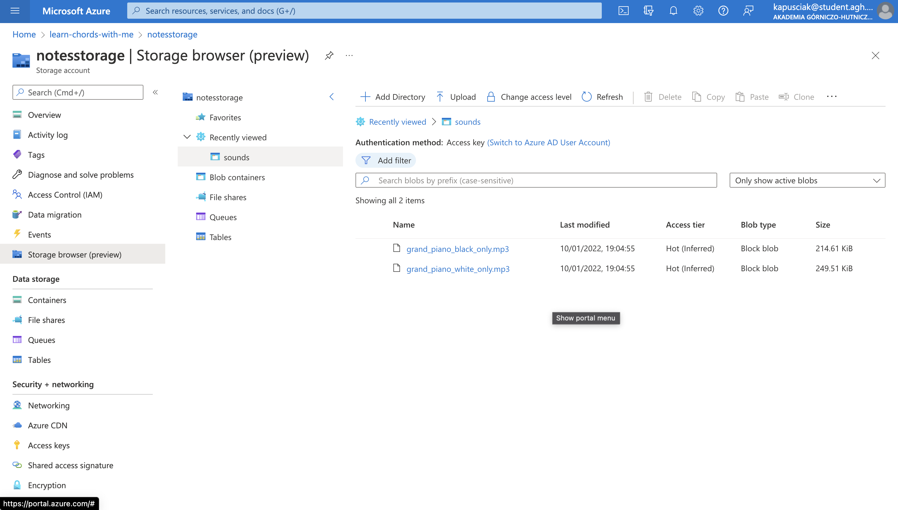

## Autoryzacja

Aplikacja do procesu autoryzacji wykorzystuje usługę `Active Directory` skonfigurowaną odpowiednio do użycia z aplikacją typu Single-page. 


Proces logowania użytkownika wywoływany jest po wcisnięciu przycisku `Sign In` na stronie startowej aplikacji.

